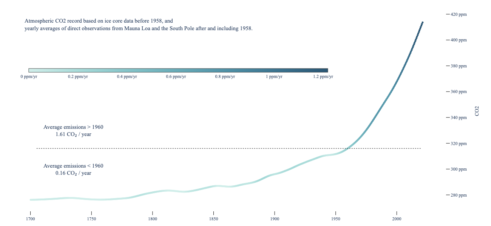

## Applied Tufte Principles
1. The representation of numbers, as physically measured on the surface of the graphic itself, should be directly proportional to the numerical quantities represented (p. 77)
2. Write out explanations of the data on the graphic itself. Label important events in the data (p.77)
3. Show data variation, not design variation (p. 77)
4. Maximize the data-ink ratio. Erase non-data ink and redundant data-ink (p.105)

--- 